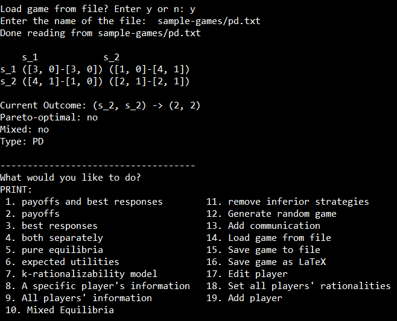

# `gt`
`gt` is a game theory application that allows for the displaying and basic manipulation of simultaneous games, including a simulation of the players making their choices by choosing the maximum payoff in the `computeChoices()` function in `simGame.h`. 

