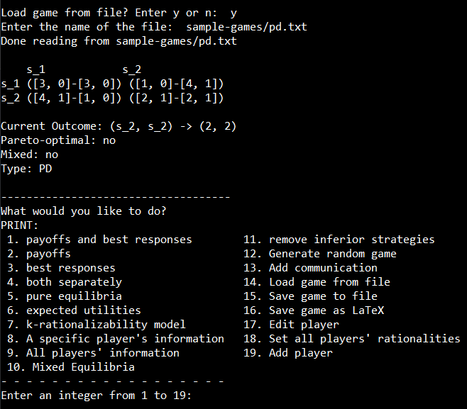

# `gt`
`gt` is a game theory application that allows for the displaying and basic manipulation of simultaneous games, including a simulation of the players making their choices by choosing the maximum payoff in the `computeChoices()` function in `simGame.h`. 



To compile the code, download and install [TDM-GCC](https://jmeubank.github.io/tdm-gcc/) and enter 
```
> g++ -std=c++11 game.cpp
```